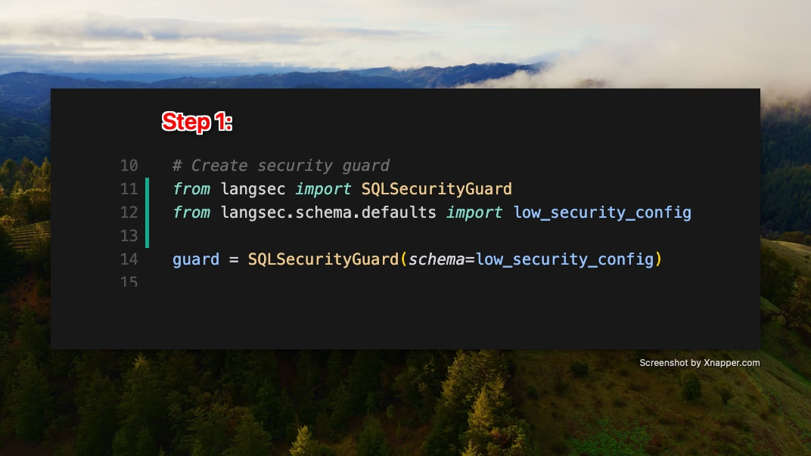
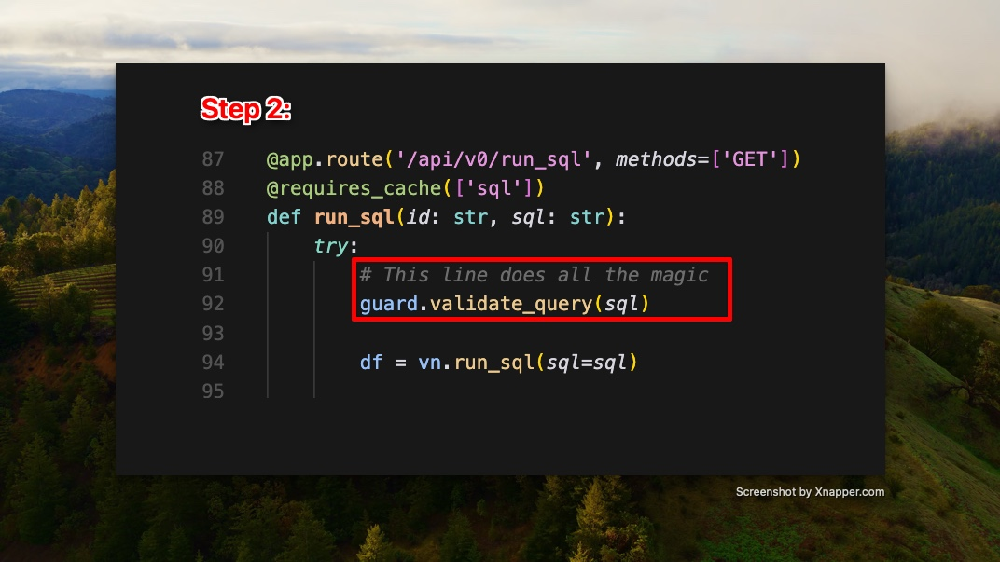
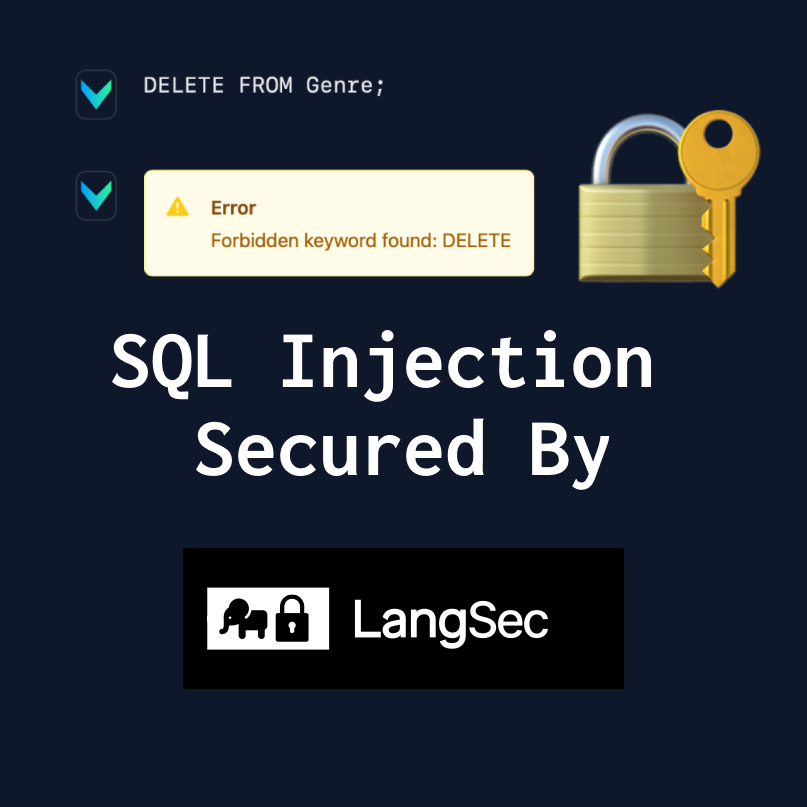

> This repo is a DEMO of Text-To-SQL with security capabilities provided by langsec. Read more 👉 https://docs.lang-sec.com  

# Overview

LangSec is a security package that checks and secures SQL queries from language models. It stops SQL injection and unauthorized access, keeping database interactions safe.


# How to Use

## Step 1: Set up security guard

Start by setting up `SQLSecurityGuard` with a security schema. This schema sets the rules for SQL queries.



## Step 2: Secure your SQL queries

With the security guard ready, check SQL queries to make sure they follow the schema, preventing unauthorized access and SQL injection.



# vanna
https://github.com/vanna-ai/vanna-flask  
Vanna is the leading **Text-to-SQL** framework with **11k+ stars** on Github  
This demo allows you to interact with the *Lorem Ipsum* database file of SQL which is called `Chinook.sql` 



# Setup
1. Create a `.env` file with the following content:  

```
VANNA_MODEL=chinook
VANNA_API_KEY=${YOUR VANNA API KEY}
SNOWFLAKE_ACCOUNT=
SNOWFLAKE_USERNAME=
SNOWFLAKE_PASSWORD=
SNOWFLAKE_DATABASE=
SNOWFLAKE_WAREHOUSE=
```

2. Create venv and install requirements
```bash
python3 -m venv venv
source venv/bin/activate
pip install -r requirements.txt
```

3. `python app.py`
